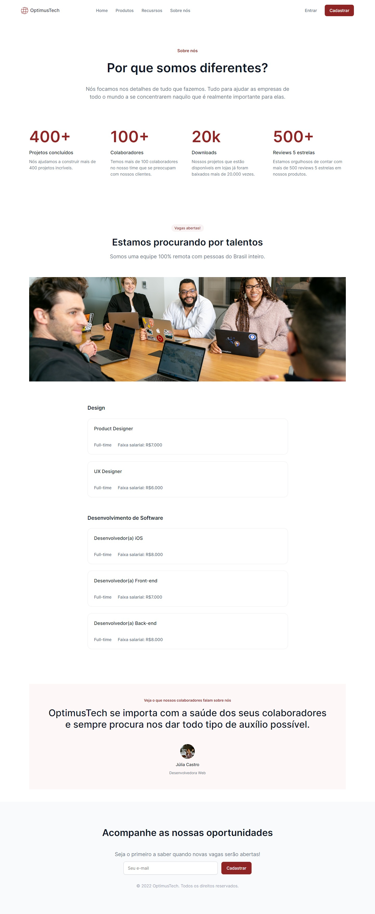

# 7 Days of Code - OptmusTech

Esta é uma solução para o [desafio 7daysofcode](https://7daysofcode.io/matricula/html-css). O desafios de 7 dias de coding proposto pela Giovanna Moeller me ajudou a melhorar minhas habilidades de codificação criando uma landing page realista. 
    
## Índice

- [Visão geral](#visao-geral)
  - [Captura de tela](#captura-de-tela)
  - [Links](#links)
- [Meu processo](#meu-processo)
  - [Construído com](#construido-com)
- [Autor](#autor)
- [Agradecimentos](#agradecimentos)

## Visão geral

### Captura de tela

### Links

- URL da solução: [GitHub](https://github.com/Gschristofano/7daysofcode)
- Live Site URL: [Netlify](https://7dayscode.netlify.app/)

## Meu processo

### Construído com
    
- Marcação semântica HTML5
- Propriedades personalizadas do CSS
- Flexbox
- CSS Grid
    
## Autor

 

- LinkedIn - [Guilherme S. Christofano](https://www.linkedin.com/in/guilherme-christofano/)

## Agradecimentos

Como de costume, agradeço aos meus amigos e desenvolvedores [Gustavo Maisatto](https://github.com/gustavomaisatto) e [Fabio Pecora Lopes](https://www.linkedin.com/in/fabio-dominicheli-pecora-lopes/) por sempre me encorajar a solucionar problemas e desafios front-end, a [Giovanna Moeller](https://www.linkedin.com/in/giovannamoeller/) pela proposta do desafio [7daysofcode](https://7daysofcode.io/matricula/html-css) e por ultimo, mas não menos importante, aos meus professores e colegas de universidade.
Obrigado!
